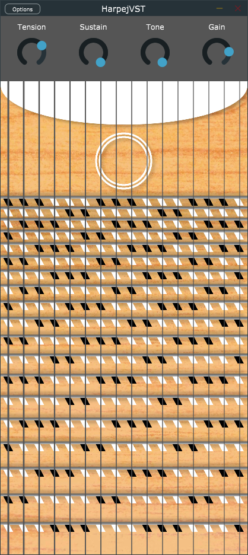

# Harpejji-VST

This VST plugin is a virtual instrument that emulates the sound of an Harpejji, created as my Bachelor's thesis project using physical modeling synthesis techniques. The plugin was built using the JUCE framework in C++, and can be used within any DAW that supports VST3 plugins or as a standalone application in Windows (or in MacOS if compiled again on an Apple machine).

  

For more information you can read the document of the thesis in spanish [here](Harpejji_VST_Spanish.pdf) or automatically translated to english (with some errors in the translation) [here](Harpejji_VST_Translated.pdf).

## Installation
To install the plugin, follow these steps:
1. Download the VST3 release from the [release](Release) folder.
2. Extract the ZIP file to your VST3 plugin directory.
3. Open your DAW and scan for new plugins.
4. Load the plugin into a MIDI or instrument track and start playing!

To use the standalone application (Windows):
1. Download the .exe file from the [release](Release) folder.
2. Extract the ZIP file and execute it.
3. Start playing with any connected MIDI device!

## Development

This plugin was developed as a Bachelor's thesis project using physical modeling synthesis techniques to model the vibration of the strings and the JUCE framework in C++. The code is available on this GitHub repository and contributions are welcome. To build the plugin from source, follow these steps:

1. Clone the repository: `git clone https://github.com/ABsoundsDSP/Harpejji-VST`
2. Open the `HarpejjiVST.jucer` file in the Projucer application.
3. Configure your build settings and export the project to your preferred IDE or build system.
4. Build the project and run the plugin in your DAW.
